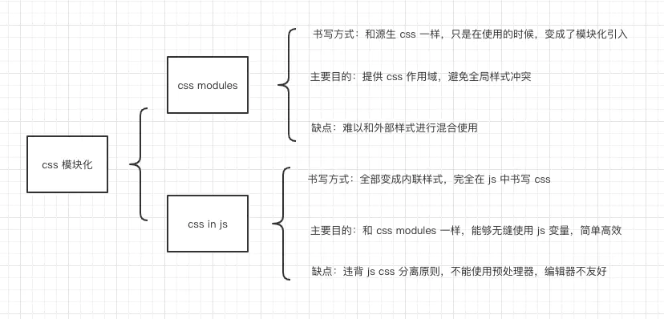

# css

## css 模块化

### 为什么要模块化

为了解决 class 命名问题、层级结构不清晰问题、代码难以复用问题、单个 css 庞大的问题

### css 模块化的实现方式

#### BEM 命名规范

BEM: block、element、modifier
是一种前端命名方法论，通过规范命名方式实现模块化
**规则** ：

> - 中划线 ：仅作为连字符使用，表示某个块或者某个子元素的多单词之间的连接记号。
>   \__ 双下划线：双下划线用来连接块和块的子元素
>   _ 单下划线：单下划线用来描述一个块或者块的子元素的一种状态

示例

```html
.form { } .form--theme-xmas { } .form--simple { } .form__input { } .form__submit
{ } .form__submit--disabled { } //对应的HTML结构如下：
<form class="form form--theme-xmas form--simple">
  <input class="form__input" type="text" />
  <input class="form__submit form__submit--disabled" type="submit" />
</form>
```

#### css Modules

像引入 js 一样去引入 css

```css
@import 'style.css' => require('./style.css')
@import url(style.css) => require('./style.css')
@import url('style.css') => require('./style.css'
url(image.png) => require('./image.png')
url('image.png') => require('./image.png')
url(./image.png) => require('./image.png');
```

需要配合 css-loader
会在打包的时候自动将类名转换成 hash 值，避免了命名冲突
使用方法

```css
.className {
  color: green;
}
/* 编写全局样式 */
:global(.className) {
  color: red;
}

/* 样式复用 */
.otherClassName {
  composes: className;
  color: yellow;
}

.otherClassName {
  composes: className from './style.css';
}
```

参考：[css-loader](https://github.com/webpack-contrib/css-loader#url)、[css-modules](https://github.com/css-modules/css-modules)

#### css in JS

用 js 写 css，是一种编写思想，已经有很多种实现，最具代表性的是 styled-components
缺点是不支持预处理器

```javascript
import React from 'react';
import styled from 'styled-components';

// 创建一个带样式的 h1 标签
const Title = styled.h1`
  font-size: 1.5em;
  text-align: center;
  color: palevioletred;
`;

// 创建一个带样式的 section 标签
const Wrapper = styled.section`
  padding: 4em;
  background: papayawhip;
`;

// 通过属性动态定义样式
const Button = styled.button`
  background: ${props => (props.primary ? 'palevioletred' : 'white')};
  color: ${props => (props.primary ? 'white' : 'palevioletred')};

  font-size: 1em;
  margin: 1em;
  padding: 0.25em 1em;
  border: 2px solid palevioletred;
  border-radius: 3px;
`;

// 样式复用
const TomatoButton = styled(Button)`
  color: tomato;
  border-color: tomato;
`;

<Wrapper>
  <Title>Hello World, this is my first styled component!</Title>
  <Button primary>Primary</Button>
</Wrapper>;
```


参考：[css 模块化](https://juejin.im/post/6844904034281734151#heading-5)

## css 布局方案

### 正常流布局

浏览器默认的布局方式，按照 HTML 的书写排列

### display

`display:inline/block/inline-block`，改变元素的行为方式

### flex 弹性盒

用于一维布局     
基本使用方法：

```css
display:flex｜inline-flex;定义容器
flex-direction:row｜row-reverse｜column｜column-reverse;定义主轴方向
justify-content:stretch｜flex-start｜flex-end｜center｜space-around｜space-between;主轴对齐方式
align-items:strech｜flex-start｜flex-end｜center;交叉轴方向的对齐方式
flex-wrap:nowrap｜wrap;多行flex
flex-grow:n;控制元素放大
flex-shrink:n;控制元素收缩
flex-basis:;定义元素的空间大小
flex:1 0 100px;是上面三个属性的缩写
```

### grid 网格

基于网格的二维布局
基本使用方法

```css
父元素{
  display:grid｜inline-grid;创建容器
  grid-template-columns:80px auto 100px;几个值就表示几列，可依次设置从左至右的每列的尺寸
  grid-template-rows:25% 100px auto 60px;几个值就表示几行，依次设置高度
  grid-template-columns: repeat(24, 40px [col-start]);可以用repeat简化
  还可以用fr表示分数
  grid-template-columns: 1fr 1fr 1fr;
  grid-gap:10px 10px;设置横竖间隙
  justify-items: stretch | start | end | center;水平呈现方式
  align-items: stretch | start | end | center;垂直呈现方式
  justify-content: stretch | start | end | center | space-between | space-around | space-evenly;
  网格元素的水平分布方式
  align-content: stretch | start | end | center | space-between | space-around | space-evenly;
  网格元素的垂直分布方式
}
子元素{
  grid-column-start, grid-column-end, grid-row-start和grid-row-end设置水平、垂直方向起止位置
  grid-area是grid-row-start, grid-column-start, grid-row-end 以及 grid-column-end属性的缩写，以及额外支持grid-template-areas设置的网格名称
	justify-self: stretch | start | end | center;单个网格元素的水平对齐方式
  align-self: stretch | start | end | center;单个网格元素的垂直对齐方式

}
```

还可以用 grid-template-areas 划分区域

```html
<div class="container">
  <div class="putao"></div>
  <div class="longxia"></div>
  <div class="yangyu"></div>
  <div class="xigua"></div>
</div>
```

```css
.container {
  grid-template-columns: 1fr 1fr 1fr;
  grid-template-rows: 1fr 1fr 1fr 1fr;
  grid-template-areas:
    '葡萄 葡萄 葡萄'
    '龙虾 养鱼 养鱼'
    '龙虾 养鱼 养鱼'
    '西瓜 西瓜 西瓜';
}
.putao {
  grid-area: 葡萄;
}
.longxia {
  grid-area: 龙虾;
}
.yangyu {
  grid-area: 养鱼;
}
.xigua {
  grid-area: 西瓜;
}
```

**注意**  在 Grid 布局中，`float`，`display:inline-block`，`display:table-cell`，`vertical-align`以及`column-*`这些属性和声明对 grid 子项是没有任何作用的。

参考：[张鑫旭-grid](https://www.zhangxinxu.com/wordpress/2018/11/display-grid-css-css3/)

### float 浮动

设置元素浮动，移出正常文档流，周围元素会环绕这个元素

```css
/* Keyword values */
float: left;
float: right;
float: none;
float: inline-start;
float: inline-end;
/* Global values */
float: inherit;
float: initial;
float: unset;
```

但当包含元素的高度小于 float 元素的高度时，会出现高度塌陷的问题
清除浮动：
原理就是 clear 可以 left ｜ right ｜ both 方向上不允许存在浮动元素
但是如果浮动元素在最下面，依然会高度塌陷，为了解决这个问题，就在浮动元素下面加上一个空的 div，父元素就会一起包裹进去

```css
.clearfix:after {
  display: block;
  content: '';
  clear: both;
}
```

参考：[清除浮动的远原理](https://juejin.cn/post/6844903504545316877)

### position 定位

不是主要用来做布局的，主要是微调

- static。默认文档流
- relative。相对定位，相对原本的位置移动，保留原本位置
- absolute。绝对定位，相对于最近的设置了定位的祖先元素
- fixed，固定定位。类似 absolute，但是是相对于浏览器视口
- sticky。粘性定位，在没有到设置位置的时候表现在正常文档流中，到了设置位置后就停止和 fixed 表现一样

### 表格布局

老方法，过时了

```html
<form>
  <p>First of all, tell us your name and age.</p>
  <div>
    <label for="fname">First name:</label>
    <input type="text" id="fname" />
  </div>
  <div>
    <label for="lname">Last name:</label>
    <input type="text" id="lname" />
  </div>
  <div>
    <label for="age">Age:</label>
    <input type="text" id="age" />
  </div>
</form>
```

```css
html {
  font-family: sans-serif;
}

form {
  display: table;
  margin: 0 auto;
}

form div {
  display: table-row;
}

form label,
form input {
  display: table-cell;
  margin-bottom: 10px;
}

form label {
  width: 200px;
  padding-right: 5%;
  text-align: right;
}

form input {
  width: 300px;
}

form p {
  display: table-caption;
  caption-side: bottom;
  width: 300px;
  color: #999;
  font-style: italic;
}
```

### 多列布局

多列显示

```css
column-count:;设置多少列
column-width:;设置列的宽度
```

## css3.0 常用属性

参考：[css3 属性罗列](https://juejin.cn/post/6844903925234024462)
[box-shadow 调试](https://www.cssmatic.com/box-shadow)
[gradient 调试](https://cssgradient.io/)

## sass 和 less

都是 css 预处理器，都可以通过编译转为普通 css 文件

sass 是缩排语法，像这样

```css
$font-stack:    Helvetica, sans-serif
$primary-color: #333

body
  font: 100% $font-stack
  color: $primary-color
```

由于相较于 css，不太直观，并且不能直接写 css，于是 sass3 变成了 scss，兼容原本的 css 写法
scss 像这样

```css
$font-stack: Helvetica, sans-serif;
$primary-color: #333;
body {
  font: 100% $font-stack;
  color: $primary-color;
}
```

基本用法

|      | sass/scss   | less    |
| ---- | ----------- | ------- |
| 变量 | $h:5px;     | @h:5px; |
| 混合 | @mixin xxx{ |

some code...;
}
a{
  @include xxx;
} | .bordered {
border-top: dotted 1px black; border-bottom: solid 2px black; }
a {
color: red;
.bordered();
} |
| 嵌套 | #main p {
color: #00ff00;
width: 97%;
.redbox {
color: #000000;
}
}基本相似 | #header {
  color: black;
  .navigation {
    font- size: 12px;
  }
  .logo {
    width: 300px;
  }
  $:after{}
}
还有@media 等的嵌套 |
| 运算 | +、-、_、/、% | 支持+、-、_、/
@conversion-1: 5cm + 10mm; |
| 函数 | 也有 lighten、darken 等函数 | percentage 小数转为分数 saturate 增加颜色饱和度
lighten 亮度降低 |
| 导入 | 能导入 sass 或者 scss，但是以下情况，不导入

- 文件拓展名是 `.css`；
- 文件名以 `http://` 开头；
- 文件名是 `url()`；
- `@import` 包含 media queries。

  比如`@import "library";` // `library.less`

  `@import "typo.css";`
  导入 less 文件可以省略后缀
